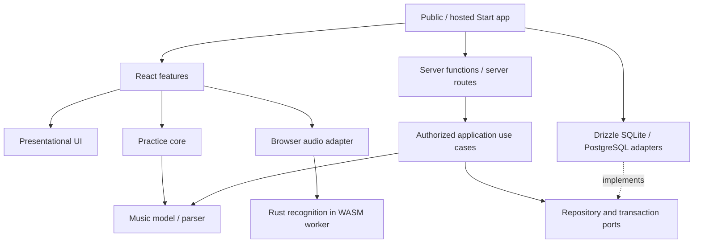

# Cadence — implementation specification

Status: ready for implementation planning. This specifies a replacement for the POC; it does not scaffold, delete, or deploy code.

The reviewed [product requirements](./DESIGN.md) and [HTML prototype](./prototype.html) define the experience. This document defines the engineering boundaries and supersedes earlier tentative stack/package suggestions in the product document.

## 1. Architecture decisions

| Area | Decision |
| --- | --- |
| Web application | React + TanStack Start + TanStack Router, TypeScript, Vite |
| Workspace | pnpm workspaces; one lockfile per repository; Cargo workspace for Rust |
| Recognition | Rust compiled to WebAssembly; browser-local execution in a dedicated worker |
| Capture | Web Audio + AudioWorklet; TypeScript handles browser lifecycle and transport |
| Practice orchestration | Framework-independent TypeScript state machine consuming Rust recognition events |
| UI | Shared React components, Radix primitives where needed, styled native selects, Lucide SVG icons, CSS tokens/modules |
| Server state | TanStack Query; request-scoped SSR cache, browser cache cleared on identity change |
| Validation | Zod for application inputs/exports/configuration; generated bindings for Rust ABI |
| Database | Drizzle ORM; SQLite personal installation and PostgreSQL configurable/hosted installation |
| Identity | Free local personal mode in public core; Clerk integration only in private repo |
| Billing | Stripe integration and entitlement enforcement only in private repo |
| Deployment | Node server container with persistent volume; optional external PostgreSQL |

Pin mutually compatible dependency versions when scaffolding, record Node/pnpm/Rust toolchains, and commit lockfiles. Do not inherit the POC dependency list or introduce floating `latest` container tags in release documentation. Framework version checks happen at implementation time; the specification does not invent release numbers.

There is one audio recognition implementation: Rust. JavaScript must not contain a fallback chord matcher, spectral analyzer, onset detector, or separate confidence timer. Synthetic tests exercise the same Rust engine as live capture.

## 2. Two repositories

### Public: `cadence`

Complete free practice application, Rust engine, music library/imports, UI, storage, local identity, and packaging. No Clerk SDK, Stripe SDK, billing table, hosted entitlement check, or mandatory provider credential.

```text
apps/
  web/                         # public TanStack Start application/composition root
    src/routes/                # file routes, loaders, server routes
    src/functions/             # thin createServerFn wrappers
    src/server/                # request identity and service composition
    src/start.ts               # middleware composition and CSRF protection
    src/router.tsx             # router and request-scoped query integration
packages/
  contracts/                   # DTOs, Zod schemas, transport-safe errors
  music/                       # notation, chord/voicing catalog, chart parsing
  core/                        # pure practice state machine
  audio-engine/                # generated WASM package + handwritten wrapper
  audio-browser/               # capture/worklet/worker/device lifecycle
  ui/                          # tokens and presentational React components
  features/                    # shared practice/library/setup React flows
  application/                 # server use cases and repository ports
  db/                          # Drizzle adapters, schemas, migrations, CLI
    src/sqlite/
    src/postgres/
    migrations/sqlite/
    migrations/postgres/
tooling/                       # TS/Biome/boundary checks and build scripts
crates/
  cadence-dsp/                 # pure Rust audio analysis
  cadence-recognition/         # matching, stability, onset/rearm policy
  cadence-wasm/                # wasm-bindgen ABI; no browser UI code
  cadence-eval/                # offline corpus evaluation CLI
catalog/                       # versioned music/voicing data and provenance
fixtures/audio/                # small redistributable CI cases + corpus manifest
deploy/                        # Dockerfile, Compose, entrypoint, health checks
docs/                          # architecture, operation, contribution, decisions
Cargo.toml
Cargo.lock
rust-toolchain.toml
pnpm-workspace.yaml
pnpm-lock.yaml
package.json
```

### Private: `cadence-cloud`

```text
apps/cloud/                    # TanStack Start hosted composition root
packages/identity-clerk/        # verified Clerk identity -> core principal
packages/billing/               # Stripe, entitlement policy, webhook processing
packages/cloud-db/              # private PostgreSQL tables/migrations
packages/cloud-ui/              # sign-in, account, checkout/billing screens
deploy/                        # production configuration and operations
pnpm-workspace.yaml
pnpm-lock.yaml
package.json
```

Private code consumes exact, versioned public packages. Public workspace dependencies use `workspace:*`; published packages resolve those into normal versions. Use pnpm catalogs to keep shared external dependencies aligned. These are supported workspace/catalog mechanisms. [pnpm workspaces](https://pnpm.io/workspaces), [catalogs](https://pnpm.io/catalogs).

Publish coordinated public releases with Changesets or an equivalent explicit release manifest; every release records package versions, WASM hash/protocol version, catalog version, and database compatibility. Cloud pins that release and updates through a reviewed dependency change. React, React DOM, TanStack Query, and shared UI peer dependencies resolve to a single compatible installation.

Treat the private repository as a downstream distribution, not a divergent copy of practice code. If a literal Git fork is retained operationally, keep the same package boundaries and upstream core improvements. Resolve the public license before publishing; license choice remains open.

## 3. Package responsibilities and dependency rules

| Package | Owns | Allowed internal dependencies | Must not own/import |
| --- | --- | --- | --- |
| `@cadence/contracts` | Versioned DTOs, IDs, validation, error codes | None | React, Node APIs, Drizzle, browser audio |
| `@cadence/music` | Chord symbols, pitch sets, voicings, chart parser, import/export normalization | contracts | Audio matching, database, UI |
| `@cadence/core` | Practice state/events, current position, manual movement, completion, timeline window | contracts, music | React, browser globals, DB, WASM runtime |
| `@cadence/audio-engine` | Generated WASM artifacts/types, ABI wrapper, engine version | None; generated protocol types | React, permissions, server code |
| `@cadence/audio-browser` | Web Audio graph, device discovery, AudioWorklet, worker, event bridge | contracts, audio-engine | Songs CRUD, SQL, React, recognition algorithms |
| `@cadence/ui` | Theme tokens, buttons/dialogs/forms, fretboard SVG, chord stage/timeline/dock presentation | contracts for presentation types only | Query fetching, storage, auth, audio capture, Start |
| `@cadence/features` | React flows/hooks, practice controller, library/import/setup/account slots | contracts, music, core, audio-browser, ui | Drizzle, Clerk, Stripe, server secrets, Start server APIs |
| `@cadence/application` | Authorized library/settings/position use cases; repository/transaction ports | contracts, music | Drizzle, React, Start, browser audio, provider SDKs |
| `@cadence/db` | Drizzle schemas, repository implementations, transactions, migrations | contracts, application | UI, Start routes, identity SDKs, recognition |
| `apps/web` | Composition, routing, server-function boundary, local principal, asset hosting | Public packages as appropriate to client/server entry | Domain logic duplicated from packages |

These are build boundaries, not folders that all import each other. Use explicit package `exports`; no `../../other-package/src` imports and no giant `@cadence/shared` barrel. Browser-safe and server-only modules have separate entry points. DB exposes `@cadence/db/sqlite`, `/postgres`, and `/migrate`, with no browser entry point. Build each package to ESM and declarations where appropriate; include CSS, worklet, worker, WASM, and migration assets in its published file manifest.

Enforce the table in CI using dependency-cruiser or a small equivalent boundary checker, plus TanStack import protection and a client-bundle inspection. TypeScript's types and `.server.ts` naming are useful but are not the sole security boundary.



The application layer depends on repository interfaces it owns. The outer app injects concrete Drizzle adapters; application code never imports Drizzle to complete the dependency graph.

## 4. Rust owns recognition; TypeScript owns interaction

| Rust responsibility | TypeScript responsibility |
| --- | --- |
| Windowing, spectral/pitch features, harmonic treatment | Browser microphone permission and input selection |
| Signal/noise/clipping metrics | AudioContext, stream tracks, worklet and worker lifecycle |
| Target chord scoring and confusable-chord rejection | Song selection and target pitch-set preparation |
| Stable-match accumulation in sample time | Current chart event, previous/next, repeat/finish |
| Onset/release detection and rearming | Sending target changes; rejecting stale engine events |
| Strictness profiles and calibrated thresholds | Displaying configured profile and setup diagnostics |
| Exactly one match event per armed target | Match animation and position persistence |

`cadence-dsp` accepts mono PCM at the actual AudioContext sample rate, without assuming 44.1 kHz. `cadence-recognition` owns all match validity rules and depends on DSP, not on a browser clock. `cadence-wasm` exposes a small stable interface. `cadence-eval` runs the same recognition crate against labeled files natively for repeatable evaluation.

Initial Rust dependencies: `rustfft` for planned FFTs; `wasm-bindgen` for the JS boundary; `serde` for configuration/diagnostics outside the processing loop; `hound` for WAV decoding in the evaluation CLI only. Allocate reusable windows, FFT plans, and scratch buffers on initialization/configuration, not every hop. The selected FFT library supports planned transforms; benchmark the target WASM build rather than assuming native performance. [RustFFT documentation](https://docs.rs/rustfft/latest/rustfft/).

Start with a stable Rust toolchain and a single-threaded `wasm32-unknown-unknown` build. Do not require Rust nightly, shared WASM memory, or cross-origin isolation for MVP. SIMD can be a later measured optimization with a scalar-compatible artifact. The threaded wasm-bindgen AudioWorklet example has additional build/header requirements; it is not the baseline architecture here. [wasm-bindgen AudioWorklet example](https://wasm-bindgen.github.io/wasm-bindgen/examples/wasm-audio-worklet.html).

### Recognition rules

- Reject silence, clipped/invalid input, insufficient evidence, and configured confusable alternatives before emitting success.
- Match duration is based on processed contiguous sample counts, not React render frequency, `Date.now()`, or UI frame rate.
- A match disarms the target until the caller explicitly arms a new target. Repeated events for one target are impossible by contract.
- Target replacement preserves enough onset/release history to reject an old sustained strum. Changing from C to another C requires a new attack or valid release/reattack; changing targets must not reset this protection to “ready.”
- Muting, permission/device loss, stream gaps, song replacement, seek, or disposal invalidate pending evidence. A new session requires fresh input evidence.
- Gentle/Balanced/Precise are versioned Rust profiles. Browser code selects an enum; it does not implement alternative thresholds.
- Catalog voicings and chord parsing remain in `music`; Rust receives canonical pitch classes/root and curated target/alternative descriptors, not unvalidated chord text.

## 5. Audio execution and ABI

```text
getUserMedia -> MediaStreamAudioSourceNode -> capture AudioWorklet
                                                 |
                                bounded transferable PCM buffers
                                                 |
                                     dedicated module Worker
                                                 |
                               Rust/WASM DSP + recognition state
                                                 |
                              compact metrics / match / error events
                                                 |
                                browser adapter -> practice core -> UI
```

The AudioWorklet only mixes/copies input into pooled buffers; expensive recognition runs in the worker. This avoids putting an unproven analysis workload on the audio rendering deadline. The browser adapter can later host the same engine directly in a worklet if profiling justifies it; that optimization must not change the public contract.

Initialize the worker/WASM and establish a direct `MessageChannel` with the worklet before accepting samples. Transfer the ports through their supported message interfaces; do not route every PCM block through React or the main-thread state store. Keep a silent output path where required to sustain processing, with no microphone monitoring through speakers.

Proposed transport starting point: eight reusable Float32 buffers of 2,048 samples. The worklet fills buffers from the actual input quantum length; never hardcode that the quantum is always 128 samples. The worker returns transferred buffers to the pool after processing. Do not allocate or log inside the per-quantum loop. If the pool is exhausted, drop safely, report a discontinuity, and reset contiguous match accumulation; never grow the queue or retain unbounded audio. These sizes are calibration inputs, not latency guarantees. [AudioWorklet processing contract](https://developer.mozilla.org/en-US/docs/Web/API/AudioWorkletProcessor/process).

### Proposed protocol v1

The following is the intended message contract, not a claim that wasm-bindgen generates these higher-level worker messages automatically:

```ts
type Target = {
  root: number;                    // validated pitch class 0..11
  pitchClassMask: number;           // 12-bit set
  alternatives: readonly number[]; // masks of curated confusable chords
};

type EngineCommand =
  | { type: 'init'; protocol: 1; sampleRate: number; profile: MatchProfile }
  | { type: 'arm'; sessionId: string; epoch: number; target: Target }
  | { type: 'profile'; profile: MatchProfile }
  | { type: 'reset'; sessionId: string; epoch: number; reason: ResetReason }
  | { type: 'dispose' };

type EngineEvent =
  | { type: 'ready'; protocol: 1; engineVersion: string }
  | { type: 'armed'; sessionId: string; epoch: number }
  | { type: 'metrics'; sessionId: string; epoch: number;
      level: number; quality: SignalQuality; matchProgress: number }
  | { type: 'matched'; sessionId: string; epoch: number;
      sequence: number; audioTimeMs: number }
  | { type: 'error'; code: EngineErrorCode; recoverable: boolean };
```

PCM messages additionally carry buffer identity, frame sequence, sample offset, session/stream generation, and valid sample count. The adapter validates protocol and ordering; the engine detects discontinuities. Keep stream generation separate from target epoch so target changes cannot accidentally validate old queued audio. Acknowledging `arm` establishes the target's valid audio boundary; flush or reject earlier queued frames. Sample/time counters must stay within JS safe-integer bounds or be serialized explicitly rather than silently narrowing Rust integers.

Expose Rust initialization, target/configuration, reset, input-buffer write/process, and fixed-format result reads through `wasm-bindgen`. Generate ABI TypeScript declarations in the build. Do not serialize PCM as JSON. Preallocate WASM input memory, copy accepted samples once, and prevent hot-path memory growth; if a wrapper retains typed views, refresh them after any operation capable of growing WASM memory.

Emit meters at a capped rate (initial target 20 Hz), and match/error events immediately. UI animation uses CSS/WAAPI; React does not re-render the application for every sample or quantum. Match progress and diagnostic data appear only in setup/debug surfaces, not in active practice.

### Lifecycle

`idle -> requesting-permission -> initializing -> muted-ready -> listening -> muted-ready`, with recoverable `error` and terminal `disposed` states. Permission/initialization triggered by Unmute may proceed directly to listening once all readiness acknowledgments arrive; selecting another device initializes muted and requires explicit unmute.

Mute immediately disables every live capture track, halts processing, increments the generation, and clears pending recognition. Stop tracks/disconnect nodes on disposal or device replacement; optionally suspend the context while muted. Resume must account for browser suspension and revalidate the current stream. Backgrounding pauses/mutes and does not silently resume on return. Microphone enabled state is never persisted.

An open menu pauses practice; idle chrome fading does not. Sample audio stays in transient bounded buffers. No PCM in logs, analytics, application server requests, or durable storage. Fixture replay is test tooling, not a production UI feature.

## 6. Practice core and React integration

`@cadence/core` exports a pure transition function and derived selectors. It accepts immutable chart data and events, and returns state plus explicit effects. It does not call a microphone, timer, database, or browser global itself.

State includes chart ID/revision, ordered events, index, paused/running/completed status, loop preference, session ID, target epoch, and last accepted match sequence. Events include start, pause, replace chart, seek, previous/next, engine armed, engine matched, engine failed, and transition finished.

On a current, armed match: accept once, render success, then advance after the UI transition completion event. On manual navigation: advance without recognition success. Both invalidate prior target events. Effects include arm target, mute capture, persist position, and announce chord. Tests use fake adapters and explicit transition completion; the domain does not wait on CSS timers.

Timeline selector returns a bounded window within the current chart. It never wraps previews into a future loop, even though actual completion can restart the chart. Repeated chord events remain distinct. Previous/next visibility follows actual sequence bounds.

`@cadence/features` subscribes to a small controller/store via `useSyncExternalStore` or equivalent, supplies core effects to browser adapters, and renders `@cadence/ui`. Server data uses TanStack Query; the live practice session is not a Query cache entry. Query clients are request-scoped on SSR to avoid cross-user cache leakage. [TanStack Query SSR](https://tanstack.com/query/latest/docs/framework/react/guides/ssr).

There is one authoritative preference value per setting. Hydrate from server DTOs; optimistic updates show failure/retry without interrupting a loaded practice session. Keep microphone device IDs browser-local. Durable progress writes are debounced/coalesced and revision-aware; restarting the app always opens paused.

## 7. UI packages and approved visual behavior

Use Radix Dialog/Tabs/Tooltip/Popover only where their accessible behavior helps, wrapped in Cadence components. Preserve the reviewed styled native select for simple forms, including native phone selection. Use `lucide-react` through the UI package for interface icons; the custom fretboard remains SVG. Do not import a generic component theme that changes the reviewed appearance. Radix supplies unstyled primitives rather than the product's visual design. [Radix introduction](https://www.radix-ui.com/primitives/docs/overview/introduction).

`@cadence/ui` exposes theme tokens, `IconButton`, `Button`, `Dialog`, `Tabs`, `Field`, `Select`, `TextInput`, `TextArea`, `Fretboard`, `ChordStage`, `ChordTimeline`, and `PracticeDock`. Domain values arrive as props. It neither discovers devices nor loads music. Forms initially use React state plus shared Zod schemas; add a form library only if requirements justify it.

Preserve these approved details:

- Logo top left; theme and Settings top right.
- Subtle shadow-free bottom dock for microphone/device picker and music library.
- Device chevron points up when closed, down when open.
- Bare side chevrons, conditional on previous/next availability, with invisible 44 px or larger hit areas.
- Four-second idle fade for utility controls; chord and fretboard remain visible. Timeline dims but never hides.
- Text-only bounded timeline; no connector lines/background fills or wrapped preview.
- Slim barre line and one index-finger number; correct left-handed mirroring.
- Light/dark token sets, reduced motion, native input access, consistent modal spacing and SVG icons.

No frontend audio mock from the prototype ships in the application. A component preview/story environment can drive these components with explicit mock props for visual review.

## 8. TanStack Start boundary

Applications own file routes, route guards, server-function wrappers, and request composition. Shared features accept a typed `CadenceGateway` for music/preferences/position operations and account-slot components; cloud supplies the same gateway contract plus private account UI. Shared features never import application route files.

Use `createServerFn` with input validation for application RPC; `GET` for reads and `POST` for writes. Loaders call server functions or query options, never DB adapters directly. Keep `.functions.ts` wrappers distinct from `.server.ts` composition code and browser-safe schemas. Start loaders are isomorphic, so server-only imports must be protected. [Start execution patterns](https://tanstack.com/start/latest/docs/framework/react/guide/code-execution-patterns).

Every server function resolves a verified principal and calls an authorized application use case. A route `beforeLoad` check improves navigation but cannot protect the endpoint by itself. In custom `src/start.ts`, explicitly install same-origin/CSRF middleware according to the pinned Start version. Use server routes for health/readiness, export downloads where appropriate, and private webhook endpoints. [Start server functions](https://tanstack.com/start/latest/docs/framework/react/guide/server-functions).

Representative flow:

```text
React import review -> gateway.saveSong(input)
  -> app createServerFn inputValidator(SaveSongSchema)
  -> request identity -> application.saveSong(principal, input)
  -> reparse/validate chart -> transaction/repository port
  -> Drizzle adapter -> DTO -> invalidate library query
```

Return stable domain error codes (`INVALID_CHART`, `UNSUPPORTED_CHORD`, `CONFLICT`, `NOT_FOUND`, `UNAUTHORIZED`, `STORAGE_UNAVAILABLE`) and safe messages, not raw SQL/provider errors. Apply request/file size limits. Server validation does not trust the client import preview. Never serialize database handles, provider sessions, or secrets into loader data.

Render the practice shell and loaded chart with SSR. Initialize browser-only audio after hydration and a user gesture. Do not access `window`, `navigator`, `AudioContext`, or instantiate WASM during server module evaluation. Theme initialization must avoid hydration mismatches/flash; only the theme preference may be exposed to the early theme script, not user data.

## 9. Drizzle storage design

The DB package owns both dialect implementations under distinct exports:

```text
@cadence/db/sqlite     -> drizzle-orm/better-sqlite3 + better-sqlite3
@cadence/db/postgres   -> drizzle-orm/node-postgres + pg
@cadence/db/migrate    -> explicit dialect-specific migration runner
```

Use ordinary PostgreSQL URLs for local Postgres, Neon, Supabase, or another provider; configure TLS and pool mode appropriately for the selected host. Do not depend on provider auth APIs or a provider-specific HTTP SQL driver for the default Node runtime. Drizzle supports SQLite and PostgreSQL through dialect-specific drivers; it does not make one table declaration/migration portable across both. [SQLite setup](https://orm.drizzle.team/docs/get-started-sqlite), [PostgreSQL setup](https://orm.drizzle.team/docs/get-started-postgresql).

### Public tables

| Table | Key fields and invariants |
| --- | --- |
| `users` | Internal opaque UUID, creation/update timestamps; no vendor ID as PK |
| `preferences` | User FK/PK, schema version, typed JSON settings, integer revision |
| `songs` | ID, owner user or catalog scope, title, attribution/provenance, chart version, revision |
| `song_events` | Song FK, ordinal, normalized symbol/descriptor, voicing ID; unique song/ordinal |
| `practice_positions` | User/song composite key, song revision, event ordinal, completed flag, revision |
| `catalog_releases` | Catalog version and installed content hashes for idempotent seeds |

Enforce exactly one scope for a song: catalog or owned. Catalog entries are read-only; editing produces an owned copy. Repository queries always scope personal records to the principal. Do not accidentally cascade deleting a user into shared catalog content. Chart replacement and event replacement occur atomically; reconcile stale positions against chart revision. Use optimistic revision checks to reject conflicting updates rather than overwriting them.

Use matching application DTO semantics across dialects: UUID strings, UTC timestamps, validated JSON, integers/booleans. Map SQLite representations and PostgreSQL native types explicitly. Avoid PostgreSQL-only logic in application use cases. Enable SQLite foreign keys, WAL, a bounded busy timeout, and supported local-disk persistence; do not scale a single SQLite volume across multiple app replicas.

### Repository ports

Expose user, song, preferences, and position repositories plus a `UnitOfWork` transaction boundary from `application`. Ports return domain values/DTOs and accept actor scope; no Drizzle table types, query builders, or SQL fragments escape `db`. Transaction callbacks receive transaction-scoped repositories so multi-table chart writes are atomic on both dialects.

Connection pools can be process-scoped; principals/transactions must be request-scoped. Health/readiness must not leak connection strings. Redact SQL bind values containing personal chart text from production logs.

### Migration ownership

- Maintain two reviewed schemas and two generated SQL migration directories in `db`, with independent Drizzle configs and parity tests.
- Commit generated SQL and migration metadata. Run `drizzle-kit generate` during development and the migration runner during controlled initialization/upgrade. Do not use `drizzle-kit push` against production.
- Container startup may initialize an empty personal DB. Existing-schema upgrades run as an explicit migration command/job with backup guidance and exclusive coordination; app replicas do not race to migrate.
- On Postgres use a migration lock or serialized deployment job; on SQLite require a single migration process before serving requests.
- Apply public migrations before private migrations. Private `cloud-db` has a separate schema/history namespace and owns identity mappings, Stripe customers, entitlements, and webhook events. Public migrations cannot read or alter those tables.
- Prefer additive compatible changes; destructive changes require a release-specific data migration and restore plan. SQLite/Postgres portability is through versioned data export/import, not copying DB files or replaying one dialect's SQL.

Drizzle Kit supplies generation/application tooling; migration scheduling and operational safety remain Cadence responsibilities. [Drizzle Kit overview](https://orm.drizzle.team/docs/kit-overview).

## 10. Identity, hosting, and private extensions

`Principal = { userId, mode }` is resolved server-side by the application composition root. Core use cases do not inspect Clerk tokens or payment state.

Personal self-hosted mode provisions one local user idempotently and needs no login or provider account. Ship a localhost-bound published port and enforce configured origin/host policy to avoid presenting anonymous personal mode as a safe public service. Authenticated internet-facing self-hosting requires a separate vendor-independent identity profile; it is not silently provided by the private Clerk package. Do not claim support for that profile until implemented.

Cloud uses `@clerk/tanstack-react-start` in private middleware and UI, mapping verified subjects to internal users. Account deletion and identity mapping are private adapter responsibilities. Protect every RPC/data route regardless of client routing. Clerk has a framework-specific Start integration. [Clerk Start quickstart](https://clerk.com/docs/tanstack-react-start/getting-started/quickstart).

Private `billing` resolves hosted entitlements at the server boundary, invokes Stripe Checkout/portal, and processes signed webhook events idempotently. It covers monthly/annual subscriptions and one-time lifetime grants with explicit paid/expired/grace/refunded states. The public core has no fake payment flags or license gate. Expired cloud access retains export/account management per the product spec. Cloud policy protects its service; it cannot and need not prevent a user from running the public client/core elsewhere.

For application composition, inject a private access-policy adapter before hosted use cases and render private account components through feature slots. Do not sprinkle `if (isCloud)` provider imports across shared UI. Published public packages and public images must build without the private repo present.

## 11. Build and local development contract

Use pnpm for all JavaScript commands and Cargo for Rust. Do not introduce npm/yarn lockfiles. Configure pnpm workspaces/catalogs and explicit dependency build approval for required native drivers; do not globally permit every dependency lifecycle script.

Proposed root commands:

| Command | Intended behavior |
| --- | --- |
| `pnpm dev` | Build WASM if absent/stale, then start Start/Vite development; clear missing-toolchain errors |
| `pnpm dev:wasm` | Rebuild Rust/WASM on relevant changes; restart/reload engine safely |
| `pnpm build` | Generate music artifacts and WASM, build dependent packages in order, build app |
| `pnpm check` | Formatting/lint, package boundaries, TypeScript checks, Rust fmt/clippy |
| `pnpm test` | TypeScript tests and Rust unit/fixture tests |
| `pnpm test:db` | Repository/migration suites for temporary SQLite and disposable PostgreSQL |
| `pnpm test:e2e` | Playwright browser scenarios against built app |
| `pnpm eval:audio` | Offline labeled-corpus evaluation with engine/config version in results |
| `pnpm db:generate` | Explicit dialect selection; generate SQL only |
| `pnpm db:migrate` | Explicit target URL/dialect, safe migration runner |
| `pnpm container:build` | Build release image including WASM and migrations |

These commands are a required future interface, not existing executable scripts. pnpm recursive/filter ordering is enough initially; do not add a task orchestrator solely to wrap these few steps. Rust/WASM compilation precedes package compilation and must be part of CI, not a manually copied binary.

Compile `cadence-wasm` using Cargo plus matching `wasm-bindgen` tooling (or pinned wasm-pack) to generate browser-loadable assets and declarations into `audio-engine`. Test that worker URLs, worklet modules, and the WASM file resolve from the final app image, not only the dev server. Serve immutable content-hashed assets with the correct MIME types and a CSP compatible with WASM/workers. Keep source maps governed by the deployment's release policy.

## 12. Container/runtime contract

Default runtime: a pinned supported Node LTS on a glibc-based minimal image, non-root user, read-only application files, writable `/data`, correct volume ownership, process signal handling, health/readiness routes. Build Rust and native SQLite bindings in build stages matching the target architecture; runtime users do not need Rust, pnpm, or a compiler.

Target command (image namespace/release must be filled at publication):

```sh
docker run --detach --name cadence \
  --publish 127.0.0.1:3000:3000 \
  --volume cadence-data:/data \
  ghcr.io/<owner>/cadence:<release>
```

`DATABASE_URL=file:/data/cadence.db` and `AUTH_MODE=local` are defaults. PostgreSQL is an explicit configuration URL, with a Compose example for a bundled local database. HTTPS is required for supported remote microphone access; localhost use follows browser secure-context behavior. Document backups, recovery, provider TLS/pooling, and upgrades separately from the end-user interface.

Build/test amd64 and arm64 images. Hosted app replicas use PostgreSQL, run migrations once per deployment, and store no essential state on the instance filesystem. Do not claim that a free one-command personal container also configures internet DNS, TLS, or a public identity system.

## 13. Validation and release gates

| Boundary | Required evidence |
| --- | --- |
| Rust DSP/recognition | Unit tests, deterministic fixtures, silence/noise/wrong chords, repeated-chord rearm, discontinuities, multiple sample rates |
| Rust/WASM wrapper | Same fixture outputs within numerical tolerance; init/dispose, protocol mismatch, buffer reuse, no stale-memory views |
| Audio browser | Permission errors, mute/unmute, device replacement/loss, background resume, no speaker feedback, bounded queue under worker stalls |
| Practice core | Stale epoch/duplicate match rejection, manual skips, pause, final completion, looping, bounded timeline |
| Music | Complete syntax consumption, unsupported chords, repeat order, correct voicings/barres, safe import/export and limits |
| Application/DB | Shared repository contract suite on real SQLite/Postgres; ownership, transaction rollback, conflict handling, migration from prior release |
| UI | Approved layouts, both themes, keyboard/screen-reader states, reduced motion, idle fade, timeline visibility, left-handed diagrams |
| Container | Blank one-command startup, data survives restart, migration/backup restore, no provider accounts, final asset URLs |
| Cloud | User isolation, auth lifecycle, signed/duplicate/out-of-order billing events, entitlement expiry, export after expiration |

Use Poku as the top-level runner for all test suites, including pure TS/application tests, Testing Library component behavior, Playwright-driven browser journeys, and Rust/WASM checks. Invoke the native Rust harness through Poku and use the same corpus for native/wasm comparison. Tests precede implementation (TDD). Avoid snapshots of implementation details or tests that only repeat constants.

Before public recognition release, collect a consented/licensed corpus across acoustic/electric guitars, fingerings, instruments, microphones, rooms, devices, and quiet/wrong/repeated/sustained inputs. Keep calibration and held-out evaluation split by player/recording source. Track precision/recall per supported chord, false advances, missed matches, and end-to-end latency rather than cosine-score averages.

Proposed release targets for review, not measured claims: at least 95% success on clean supported held-out chord attempts, at most 1% false advances on labeled wrong-chord attempts, zero advances on the dedicated silence/sustained-repeat regression cases, and p95 onset-to-match under 650 ms on the published supported device set. Report per-chord breakdowns; an aggregate score cannot hide a failing chord. Final thresholds and the supported-device matrix must be agreed using the first real-instrument spike.

Boundary CI also fails on server secrets/DB/vendor SDKs in public browser bundles, undeclared package imports, malformed WASM assets, or a public build that requires private credentials. Synthetic mic tests establish plumbing, not real-world recognition accuracy.

## 14. Implementation sequence

1. Preserve the reviewed design/spec and record the license choice; inventory then delete the POC as the next explicitly scheduled implementation phase.
2. Establish pnpm/Cargo workspaces, package export rules, CI checks, and shared contracts.
3. Build the Rust engine and real-recording evaluation spike, then its worker/worklet adapter. Validate latency/accuracy feasibility before broad application work.
4. Build music validation, the pure practice core, and SQLite/Postgres repository/migration parity.
5. Implement the approved UI/features in the public Start app; wire actual audio events and server functions.
6. Verify public single-container startup, portability, browser support, and recovery behavior.
7. Publish a versioned public release; compose the private Start application with Clerk, PostgreSQL, and Stripe.
8. Complete real-instrument, access-control, billing, and operating checks before either release is presented as usable.

The stack and ownership boundaries are settled by this spec. Remaining product decisions are license, final hosted prices/lifetime terms, and the measured recognition/support matrix. They do not prevent package scaffolding or the Rust recognition spike.
